# Práctica Semana 8 — Contenerización de Aplicación Frontend con React y API REST

**Asignatura:** Contenerización de Aplicaciones  
**Estudiante:** Zaida Jumbo  
**Instituto:** Instituto Sudamericano  
**Fecha:** 10 de Junio 2026

---

## Descripción

Aplicación fullstack contenerizada con Docker Compose, compuesta por:

- **Frontend** — React (interfaz de usuario dinámica)
- **Backend** — Node.js + Express (API REST)
- **Base de datos** — PostgreSQL

El objetivo es demostrar la comunicación entre los tres servicios dentro de un entorno Docker, desde el desarrollo hasta la ejecución en contenedores.

---

## Objetivo

Desarrollar y contenerizar una aplicación frontend en React que consuma datos desde una API REST, junto con un backend Node.js/Express y una base de datos PostgreSQL, orquestando todo mediante Docker Compose.

---

## Herramientas Utilizadas

| Herramienta | Propósito |
|---|---|
| Ubuntu WSL | Entorno de desarrollo |
| Docker Desktop | Motor de contenedores |
| Docker Compose | Orquestación multicontenedor |
| Node.js + Express | API REST (backend) |
| React | Interfaz de usuario (frontend) |
| PostgreSQL | Base de datos relacional |
| Visual Studio Code | Editor de código |

---

## Estructura del Proyecto

```
proyecto/
├── backend/
│   ├── server.js
│   ├── package.json
│   └── Dockerfile
├── frontend/
│   ├── src/
│   │   └── App.jsx
│   ├── package.json
│   └── Dockerfile
├── docker-compose.yml
└── README.md
```

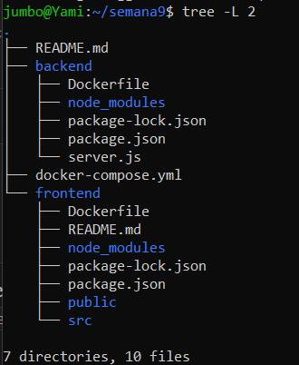

---

## Desarrollo

### 1. Backend — API REST con Express

Se implementó un servidor Express que expone un endpoint `/usuarios` para obtener registros desde PostgreSQL.

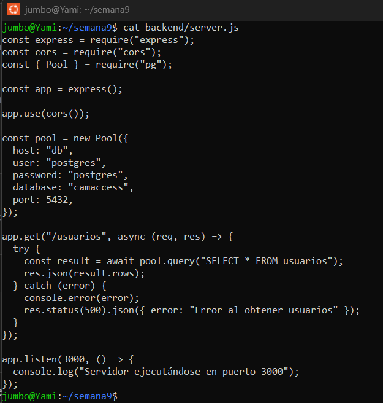

---

### 2. Dockerfile del Backend

Contenerización del servidor Node.js/Express.

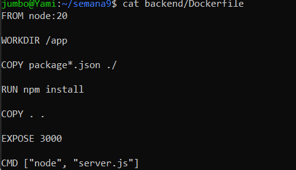

---

### 3. Frontend — Aplicación React

Componente React que consume la API mediante `fetch()` y muestra los datos en una tabla.

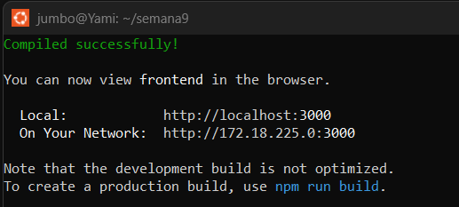

---

### 4. Dockerfile del Frontend

Contenerización de la aplicación React.

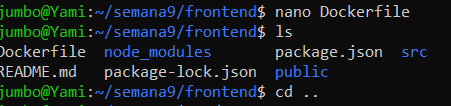

---

### 5. Docker Compose

Configuración del archivo `docker-compose.yml` para orquestar los tres servicios: frontend, backend y PostgreSQL.

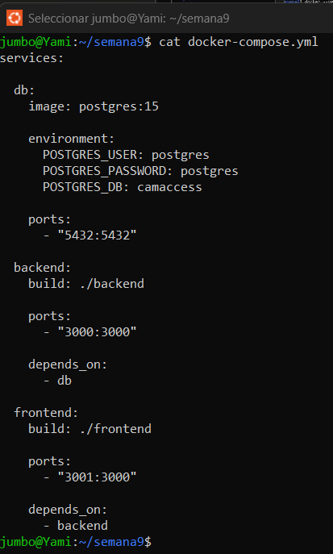

---

### 6. Construcción de Imágenes

Construcción exitosa de las imágenes Docker para frontend y backend.

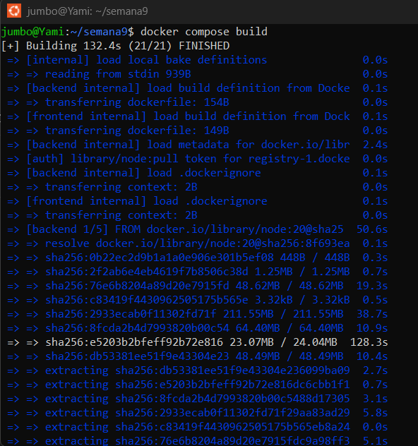

---

### 7. Contenedores en Ejecución

Verificación de los tres contenedores activos con `docker ps`.

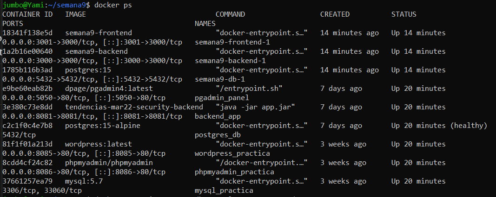

---

### 8. Base de Datos — PostgreSQL

Creación de la tabla `usuarios` e inserción de registros de prueba.

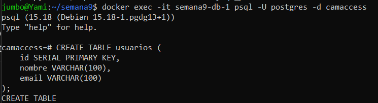

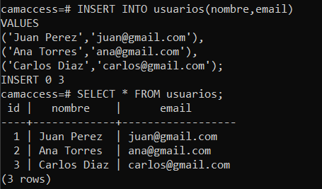

---

### 9. Prueba de la API REST

Verificación del endpoint `/usuarios` devolviendo datos en formato JSON.

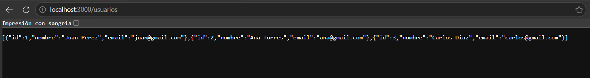

---

### 10. Visualización en el Frontend

La aplicación React consume la API y renderiza los registros en una tabla.

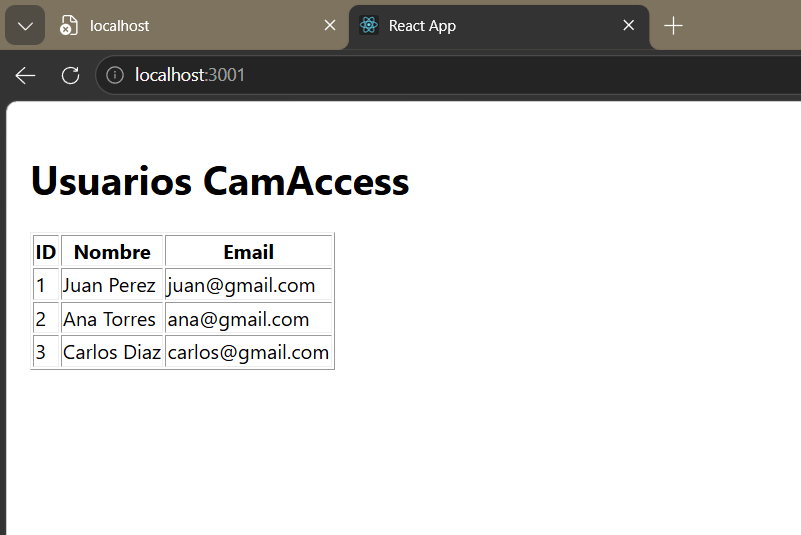

---

## Cómo Ejecutar el Proyecto

```bash
# 1. cd proyecto
# 2. Levantar todos los servicios
docker compose up --build

# 3. Acceder a la aplicación
#    Frontend:  http://localhost:3001
#    API REST:  http://localhost:3000/usuarios
```

> Asegúrate de tener Docker Desktop corriendo antes de ejecutar los comandos.

---

## Resultados Obtenidos

- API REST funcional con Node.js y Express respondiendo en formato JSON
- Frontend React consumiendo y mostrando datos desde la API
- Comunicación exitosa entre los tres servicios (frontend ↔ backend ↔ PostgreSQL)
- Los tres servicios contenerizados y orquestados con Docker Compose

---

## Conclusiones

1. Docker permite desplegar aplicaciones de forma consistente en cualquier entorno mediante contenedores.
2. Docker Compose simplifica la gestión de aplicaciones multicontenedor con un único archivo de configuración.
3. React facilita el desarrollo de interfaces dinámicas que consumen servicios REST.
4. PostgreSQL proporciona almacenamiento confiable y de alto rendimiento para aplicaciones modernas.
5. La integración frontend–backend–base de datos se logró exitosamente mediante la red interna de Docker.

---

## Referencias

- Docker Inc. (2025). *Docker Documentation*. https://docs.docker.com
- Meta. (2025). *React Documentation*. https://react.dev
- PostgreSQL Global Development Group. (2025). *PostgreSQL Documentation*. https://www.postgresql.org/docs
- Node.js Foundation. (2025). *Node.js Documentation*. https://nodejs.org/docs
- Express.js. (2025). *Express Documentation*. https://expressjs.com
